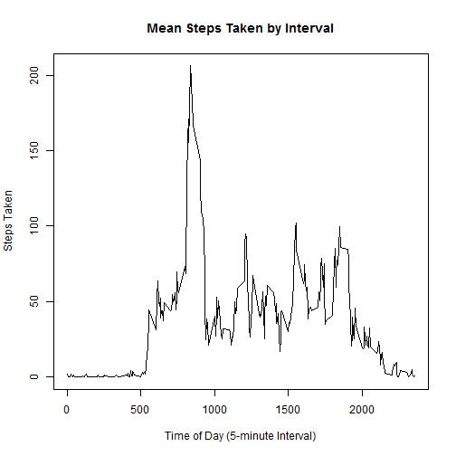

Reproducible Research - Peer Evaluation Project #1
========================================================

This markdown document outlines the steps taken to access, process and present the results of the first peer evaluated project for the Coursera Reproducible Research course within the Data Science specilization sequence offered by John's Hopkins University.

## Loading and preprocessing the data

Download the [Activity Monitoring Data](https://d396qusza40orc.cloudfront.net/repdata%2Fdata%2Factivity.zip) and extract it to the hard drive.


```r
setwd("~/")
# If loop: Check for "data" directory.  Create one if needed.
if (!file.exists("data")) {
        dir.create("data")
}

#Download dataset
if (!file.exists("./data/RR_Proj_1.zip")) {
        download.file("https://d396qusza40orc.cloudfront.net/repdata%2Fdata%2Factivity.zip",
                      destfile = "./data/RR_Proj_1.zip")
}

# Extract .zip files into "RR_Proj_1" directory
if (!file.exists("~/RR_Proj_1/activity.csv")) {
        unzip("~/data/RR_Proj_1.zip",
              exdir = "./RR_Proj_1")        
}
```

### Read the dataset into R.  


```r
stepsData <- read.csv(file = "~/RR_Proj_1/activity.csv")
str(stepsData)
```

```
## 'data.frame':	17568 obs. of  3 variables:
##  $ steps   : int  NA NA NA NA NA NA NA NA NA NA ...
##  $ date    : Factor w/ 61 levels "2012-10-01","2012-10-02",..: 1 1 1 1 1 1 1 1 1 1 ...
##  $ interval: int  0 5 10 15 20 25 30 35 40 45 ...
```

### Process/transform the data into a format that is suitable for analysis.  


```r
#Add leading zeroes so all interval values are four characters wide (first two are hour, second two are minute)
stepsData$interval <- formatC(stepsData$interval, width = 4, format = "d", flag = "0")

#Merge date and interval into a single variable and convert to POSIXct format for time series analysis
stepsData$datetime <- paste0(stepsData$date, " ", stepsData$interval)
stepsData$datetime <- as.POSIXct(stepsData$datetime, format = "%Y-%m-%d %H%M")

str(stepsData)
```

```
## 'data.frame':	17568 obs. of  4 variables:
##  $ steps   : int  NA NA NA NA NA NA NA NA NA NA ...
##  $ date    : Factor w/ 61 levels "2012-10-01","2012-10-02",..: 1 1 1 1 1 1 1 1 1 1 ...
##  $ interval: chr  "0000" "0005" "0010" "0015" ...
##  $ datetime: POSIXct, format: "2012-10-01 00:00:00" "2012-10-01 00:05:00" ...
```

## What is mean total number of steps taken per day?

### Make a histogram of the total number of steps taken each day.


```r
#Count the total number of steps per day, ignoring missing values
daySteps <- tapply(stepsData$steps, stepsData$date, FUN = sum, na.rm = TRUE)

#Plot a histogram reporting total numbers of steps taken each day
hist(daySteps, breaks = 25, xlim = c(0,25000), col = "wheat", main = "Histogram of Total Steps Taken Per Day", xlab = "Steps Taken")
```

 

### Calculate and report the mean and median total number of steps taken per day


```r
mean(daySteps, na.rm = TRUE)
```

```
## [1] 9354
```

```r
median(daySteps, na.rm = TRUE)
```

```
## [1] 10395
```

Throughout the 61-day experiment, and ignoring missing values, a mean of 9,354 steps were taken per day with a median value of 10,395 steps per day. 

## What is the average daily activity pattern?

### Make a time series plot (i.e. type = "l") of the 5-minute interval (x-axis) and the average number of steps taken, averaged across all days (y-axis)


```r
meanInterval <- aggregate(stepsData$steps, list(stepsData$interval), mean, na.rm = TRUE)
names(meanInterval) <- c("interval", "steps")
plot(meanInterval$interval, meanInterval$steps, type = "l", xlab = "Time of Day (5-minute Interval)", ylab = "Steps Taken", main = "Mean Steps Taken by Interval")
```

 

### Which 5-minute interval, on average across all the days in the dataset, contains the maximum number of steps?


```r
maxInterval <- subset(meanInterval, meanInterval$steps == max(meanInterval$steps))
maxInterval
```

```
##     interval steps
## 104     0835 206.2
```

On average, the 5-minute interval from 0835 through 0839 contains the maximum numer of steps, achieving a value of approximately 206 steps taken.

## Imputing missing values

### Note that there are a number of days/intervals where there are missing values (coded as NA). The presence of missing days may introduce bias into some calculations or summaries of the data.

### Calculate and report the total number of missing values in the dataset (i.e. the total number of rows with NAs)


```r
sum(is.na(stepsData$steps))
```

```
## [1] 2304
```

### Devise a strategy for filling in all of the missing values in the dataset. The strategy does not need to be sophisticated. For example, you could use the mean/median for that day, or the mean for that 5-minute interval, etc.

The strategy I will use to impute missing values is to average the number of steps taken across all days in the sample for each 5-minute interval.  I will then replace all missing values with the apprporiate mean number of steps taken in the corresponding interval.  For example, if there were an 15 steps taken, on average, from 8:00 AM through 8:04 Am dring the 61 day period of observation, then any missing values ("NA") in the 0800 interval will be replaced with 36. 

### Create a new dataset that is equal to the original dataset but with the missing data filled in.


```r
library(data.table)
```

```
## data.table 1.9.2  For help type: help("data.table")
```

```r
dt1 <- data.table(meanInterval, key = "interval")
dt2 <- data.table(stepsData, key = "interval")
imputedData <- merge(dt1, dt2)
remove(dt1)
remove(dt2)

# convert data table to data frame
imputedData <- as.data.frame(imputedData)
colnames(imputedData) <- c("interval", "meanSteps", "steps", "date", "datetime")

# Replace missing values (in "steps") with interval means (from "meanSteps")
imputedData[is.na(imputedData$steps),3] <- imputedData[is.na(imputedData$steps),2]

# Rearrange data frame so it's equal to original dataset with missing data filled in
imputedData <- imputedData[, c(3, 4, 1, 5)]
imputedData <- imputedData[order(imputedData$datetime),]
row.names(imputedData) <- NULL
```

### Make a histogram of the total number of steps taken each day and calculate and report the mean and median total number of steps taken per day. Do these values differ from the estimates from the first part of the assignment? What is the impact of imputing missing data on the estimates of the total daily number of steps?


```r
#Count the total number of steps per day, ignoring missing values
imputedSteps <- tapply(imputedData$steps, imputedData$date, FUN = sum)

#Plot a histogram reporting total numbers of steps taken each day
hist(imputedSteps, breaks = 25, xlim = c(0,25000), col = "wheat", main = "Histogram of Total Steps Taken Per Day (Imputed)", xlab = "Steps Taken")
```

 


```r
mean(imputedSteps)
```

```
## [1] 10766
```

```r
median(imputedSteps)
```

```
## [1] 10766
```

The process of imputing missing values adds bias to the dataset.  The mean number of daily steps taken increased from 9,354 to 10,766 following imputation, while the median increased from 10,395 to 10,766 steps taken.

## Are there differences in activity patterns between weekdays and weekends?

### For this part the weekdays() function may be of some help here. Use the dataset with the filled-in missing values for this part

### Create a new factor variable in the dataset with two levels - "weekday" and "weekend" indicating whether a given date is a weekday or weekend day


```r
# Create a new variale for which every value is "weekday"
imputedData[,5] <- "weekday"
colnames(imputedData) <- c("steps", "date", "interval", "datetime", "weekDay")

# Replace relevant observations with "weekend"
weekEndTest <- weekdays(imputedData$datetime) == "Saturday" | weekdays(imputedData$datetime) == "Sunday"
imputedData[(weekEndTest == 1),5] <- "weekend"

# Transform the new variable into a factor with two levels
imputedData <- transform(imputedData, weekDay = factor(weekDay))
imputedData <- transform(imputedData, interval = factor(interval))

str(imputedData)
```

```
## 'data.frame':	17568 obs. of  5 variables:
##  $ steps   : num  1.717 0.3396 0.1321 0.1509 0.0755 ...
##  $ date    : Factor w/ 61 levels "2012-10-01","2012-10-02",..: 1 1 1 1 1 1 1 1 1 1 ...
##  $ interval: Factor w/ 288 levels "0000","0005",..: 1 2 3 4 5 6 7 8 9 10 ...
##  $ datetime: POSIXct, format: "2012-10-01 00:00:00" "2012-10-01 00:05:00" ...
##  $ weekDay : Factor w/ 2 levels "weekday","weekend": 1 1 1 1 1 1 1 1 1 1 ...
```

### Make a panel plot containing a time series plot (i.e. type = "l") of the 5-minute interval (x-axis) and the average number of steps taken, averaged across all weekday days or weekend days (y-axis). The plot should look something like the following, which was creating using simulated data


```r
# Ensure availability of "lattice" package
if (is.element("lattice", installed.packages()[,1]) == FALSE) {
        install.packages("lattice", repos = "http://cran.us.r-project.org") }
#install.packages("lattice", repos = "http://cran.us.r-project.org")
library(lattice)

# Aggregate and format data for time-series plotting
imputedInterval <- aggregate(imputedData$steps, list(imputedData$interval, imputedData$weekDay), mean)
names(imputedInterval) <- c("interval", "weekDay", "steps")
imputedInterval$interval <- as.POSIXct(imputedInterval$interval, format = "%H%M")

# Construct plot
xyplot(steps ~ interval | weekDay, data = imputedInterval, type = "l", layout = c(1,2), scales=list(
    x=list(format = "%H%M")))
```

 
